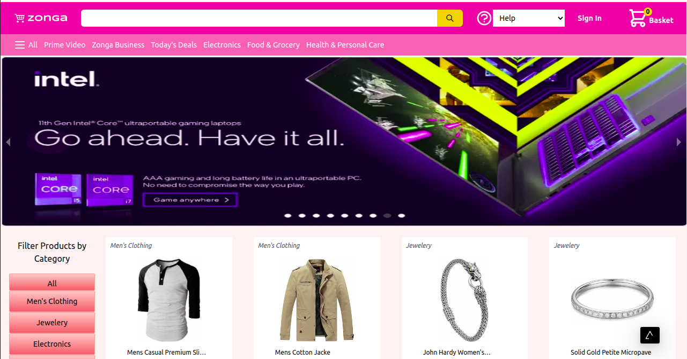
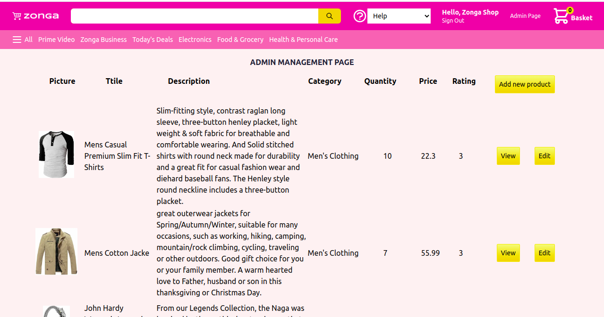
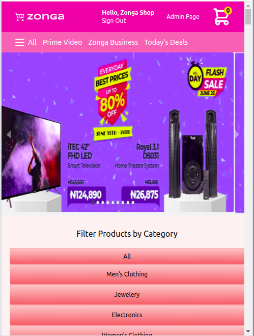

# Zonga E-commerce Shop
can log in with either their Google or Facebook accounts. Logged in users will be able to add items to the basket, remove items from the basket, and checkout. After shopping, the user can proceed to checkout. Payment is processed using Stripe - an online payment processing company. Users will be notified after their others have been processed successfully. They can view the order list before logging out. The products are stored in the MongoDB atlas database online. The app fetches the products stored in the database on the initial page load and displays them on the home page. 

This app is built with Next.js and React.js. There is an admin page that only appears when a user logs in with the store admin email address. Through the admin page, the user can add, view, delete, edit items in the store database. 

NB: The pictures are free pictures selected from the internet and stored in the picture storing site [Imgur](https://imgur.com/). The picture links are now used as a string in this project. I have a plan of adding more features to this app in the future.

## Main Features
- Users can log in with Facebook or Google accounts.
- Users can add items to the basket.
- Users can remove items from the basket
- Users can filter products based on category.
- User's payment can be processed using Stripe at checkout.
- Only Login users can make payment.
- Users can see a list of their orders before checkout.
- Completed orders are stored in Firebase.
- There is an admin dashboard for shop/site administrators.
- Only the admin can add, view, delete, and edit products in the store database.
- Webhook and Stripe functions combine to display the order information after successful payment.

## Preview

## Home Page


## Admin Page


## Mobile View


## Project SetUp
Get a local copy of the file. Clone with HTTPS following the steps below.

### For Windows
- In your search box, type cmd, click on cmd to open the command prompt.

### For Linux, Mac OS
- In your search box, type terminal, click on the terminal to launch it.

- Copy and paste the command below in your terminal and press enter from your keyboard.
```
git clone https://github.com/Zubenna/zonga-ecommerce-store.git
```
## Access Project Folder 
- Depending on where the project files are downloaded to, either Hard Disk(HDD), Desktop or Documents directory in your computer after completing the step above.
- Double click on the folder zonga-store to open it.
- Inside the folder, right-click and click on terminal or cmd depending on your Operating System to open it.

## Set Up Project Locally in Your Computer
- In the cmd or terminal, type the command below;
```
npm install
```
- Wait for some time to install all the app packages and dependencies.
- Once the installation is completed.
- Type the command below in your cmd or terminal to start the project locally. Wait for some time.
```
npm run dev
```
- Once the server is fully started, type the url http://localhost:3000/ to see the app.

## Live Version
Launch live version.
- [Launch App](https://zongashop.codes/)
Login with
- Admin email: shopzonga@gmail.com
- password: available on request

## Built With (Packages and tools)
- Next.js
- React.js
- Firebase
- Tailwind CSS
- Redux
- npm
- Axios
- Webhook
- NextAuth Authentication
- MongoDB Atlas
- Stripe
- VScode

## Author
👤 **Nnamdi Emelu**
- Github: [zubenna](https://github.com/zubenna)
- Twitter: [@zubenna](https://twitter.com/zubenna)
- Linkedin: [nnamdi-emelu](https://www.linkedin.com/in/nnamdi-emelu/)

## 🤝 Contributing
Contributions, issues, and feature requests are welcome!
Feel free to check the [issues page](https://github.com/Zubenna/zonga-ecommerce-store/issues/)

## 👍 Show Your Support
Kindly star ⭐️ this project, if you like it!

## :clap: Acknowledgements
- Sunny Sangha - For the tutorial.
